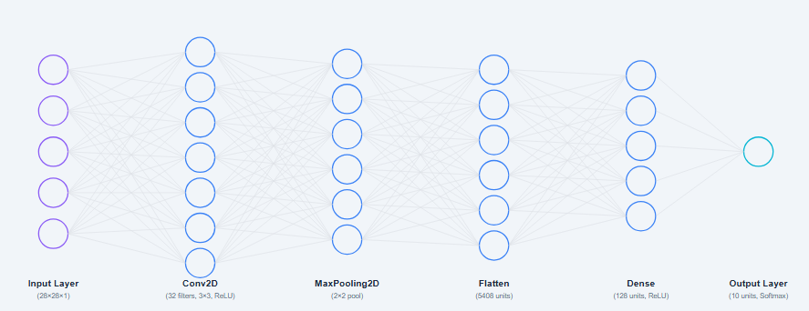

# ✨ Handwritten Digit Recognizer Web App

An interactive web application that allows users to either **upload an image** or **draw a digit**, and predicts the digit using a trained Convolutional Neural Network (CNN).

---

## 🧠 Problem Statement

Recognizing handwritten digits is a classic challenge in computer vision. The goal is to create an intelligent system that can:
- Accurately interpret digits (0–9) written by humans
- Accept inputs via image upload or drawing
- Deliver real-time prediction with confidence

This project solves the problem using deep learning and provides a smooth user experience via a web interface.

---

## 🔧 Tools Used

| Tool              | Purpose                          |
|-------------------|----------------------------------|
| Streamlit         | Web application frontend         |
| TensorFlow / Keras| Deep learning model (CNN)        |
| NumPy             | Numerical computation            |
| Pillow            | Image processing                 |
| Streamlit Canvas  | Drawing input functionality      |

---

## 📊 Model Architecture

Trained on the MNIST dataset, the CNN architecture is:



- `Conv2D(32, kernel_size=3, activation='relu')`
- `MaxPooling2D(pool_size=2)`
- `Conv2D(64, kernel_size=3, activation='relu')`
- `MaxPooling2D(pool_size=2)`
- `Flatten()`
- `Dense(128, activation='relu')`
- `Dense(10, activation='softmax')`

Trained for 5 epochs with Adam optimizer and categorical cross-entropy loss.

---

## 🚀 How to Run Locally

### ✅ Prerequisites
- Python 3.7+
- pip installed

### 📥 Clone the repository

```bash
git clone https://github.com/yourusername/digit-recognizer-app.git
cd digit-recognizer-app
```
### 📦 Install dependencies

```bash
pip install -r requirements.txt
```
### 🏃 Run the app

```bash
streamlit run app.py
```
---
### 📷 Sample Output

- [Upload Mode](images/upload_mode.png)

- [Draw Mode](images/draw_mode.png)

---

### 🌟 Features
- Draw digits freely or upload scanned/written digits

- Real-time digit recognition

- Confidence score visualization

- Clean, interactive user interface
---
### 🙌 Acknowledgements
- [MNIST Dataset](https://www.kaggle.com/datasets/hojjatk/mnist-dataset)

- Streamlit community and docs

- TensorFlow + Keras
---
## ✨ Author

- **Pratham Dabhane**

- ✅ [Github/Pratham_Dabhane](https://github.com/Pratham-Dabhane)
---